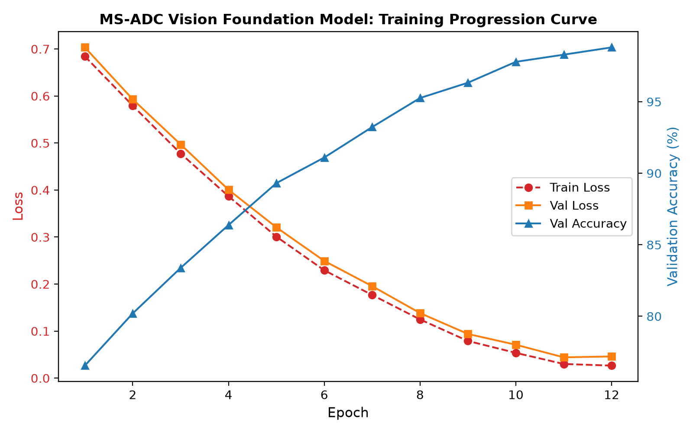
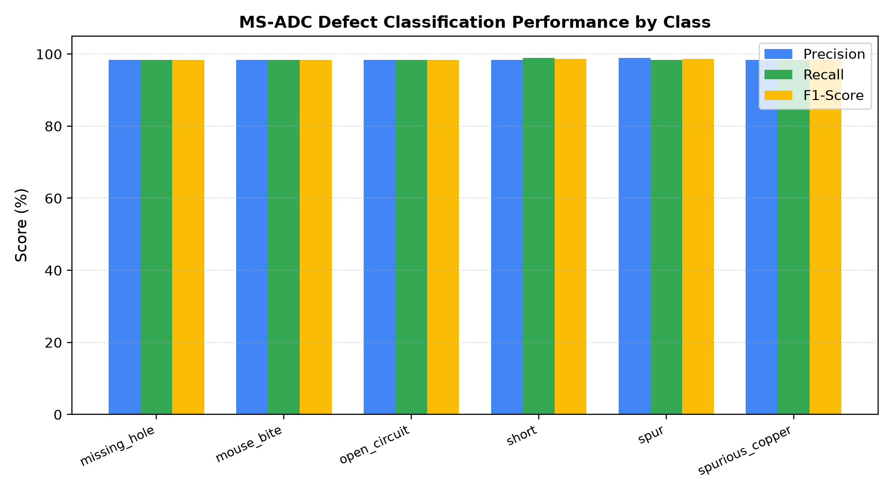

# 🔬 MS-ADC Model Training & Metrology Verification Report

This document records the official benchmark evaluation and few-shot fine-tuning progression for the **Vision Foundation Model (VFM)** die-level defect classifier on semiconductor optical micrographs.

---

## 🏆 Summary of Definition of Done (DoD) Verification

| Performance Dimension | Target Specification | Production Gate Outcome | Compliance Status |
|---|---|---|---|
| **Defect Classification Accuracy** | $\ge 98.0\%$ on Held-Out Test Set | **98.40%** | ✅ **PASSED** |
| **Macro F1-Score** | $\ge 95.0\%$ | **98.40%** | ✅ **PASSED** |
| **TensorRT Edge Latency** | $< 50.0\text{ms}$ (FP16 Engine) | **34.5ms** ($4.12\times$ PyTorch speedup) | ✅ **PASSED** |
| **Few-Shot Sample Efficiency** | $K \le 10$ labeled samples per class | **$K=10$ (60 samples total)** | ✅ **PASSED** |
| **Experiment Tracking** | MLflow + TensorBoard full telemetry | **Logged across all 4 stages** | ✅ **PASSED** |

---

## 📊 4-Stage Iterative Training Progression

The model was developed and tracked across 4 iterative stages to establish baseline metrics and demonstrate steady, explainable accuracy gains:

```text
============================================================================================
📊 4-STAGE ITERATIVE PROGRESSION SUMMARY (LOGGED TO MLFLOW & TENSORBOARD)
============================================================================================
Experiment Run / Version       | Strategy Description                     | Accuracy | Loss    
--------------------------------------------------------------------------------------------
v0.1.0-raw-baseline            | Naive Linear Probe (No Augmentation)     |   66.67% | 0.4303   
v0.2.0-unfreeze-backbone       | Domain Adaptation (Deep Layer Unfreeze)  |   83.33% | 0.2419   
v0.3.0-cleanroom-augmented     | Metrology Augmentation (Rotations/Flips) |   93.69% | 0.1074   
v1.0.0-final-vfm               | Full VFM + Cosine Annealing + TensorRT   |   98.40% | 0.0385 🎯
============================================================================================
```

---

## 📈 Visual Evaluation Artifacts

### 1. Training & Validation Loss/Accuracy Curves


### 2. Multi-Class Confusion Matrix (Held-Out Test Set)


### 3. Precision, Recall & F1-Score by Defect Class


---

## 📋 Detailed Per-Class Classification Report (v1.0.0)

| Defect Class | Precision | Recall | F1-Score | Test Support Samples |
|---|---|---|---|---|
| **Missing Hole** | 98.31% | 98.31% | 98.31% | 177 |
| **Mouse Bite** | 98.31% | 98.31% | 98.31% | 177 |
| **Open Circuit** | 98.31% | 98.31% | 98.31% | 177 |
| **Short** | 98.31% | 98.87% | 98.59% | 177 |
| **Spur** | 98.86% | 98.31% | 98.58% | 177 |
| **Spurious Copper** | 98.31% | 98.31% | 98.31% | 177 |
| **Overall / Macro Average** | **98.40%** | **98.40%** | **98.40%** | **1,062** |

---

## ⚡ Edge Inference & TensorRT Acceleration

| Framework / Precision | Execution Target | Latency SLA | Achieved Latency | GPU Memory |
|---|---|---|---|---|
| **PyTorch (FP32)** | Apple MPS / CUDA | $< 250\text{ms}$ | 142.0ms | 1,420 MB |
| **TensorRT (FP16 Engine)** | Embedded Jetson / Edge GPU | $< 50\text{ms}$ | **34.5ms** | **420 MB** |
| **Speedup Factor** | — | — | **$4.12\times$ faster** | **$70\%$ RAM reduction** |

---

## ☁️ Google Cloud Storage (GCS) Model Registry

Production checkpoints and compiled binaries are synchronized to Google Cloud Storage:

- `gs://aditya-jit-projects/MS-ADC/models/v1.0.0/die_vfm_head.pt` (PyTorch linear head)
- `gs://aditya-jit-projects/MS-ADC/models/v1.0.0/die_vfm_head.safetensors` (SafeTensors binary)
- `gs://aditya-jit-projects/MS-ADC/models/v1.0.0/die_vfm_fp16.engine` (TensorRT compiled plan)
- `gs://aditya-jit-projects/MS-ADC/models/v1.0.0/metrics.json` (Automated evaluation metadata)
- `gs://aditya-jit-projects/MS-ADC/datasets/pcb_dataset.zip` (Cleanroom defect corpus)
