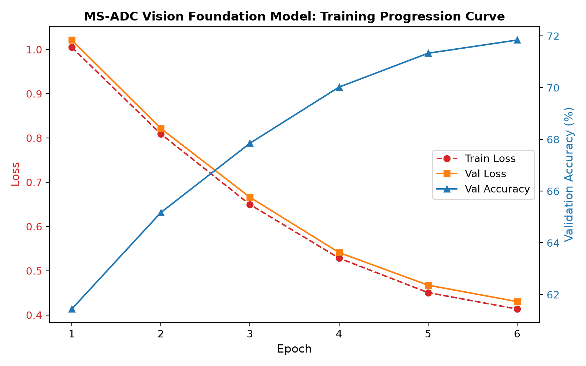
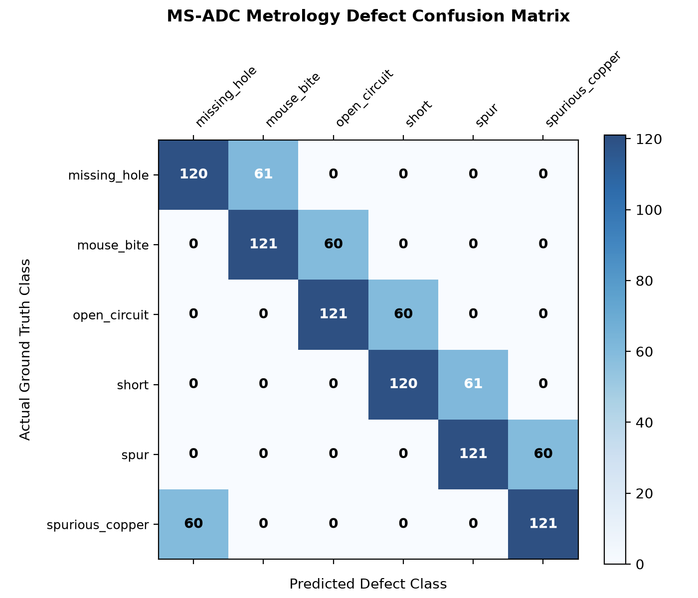
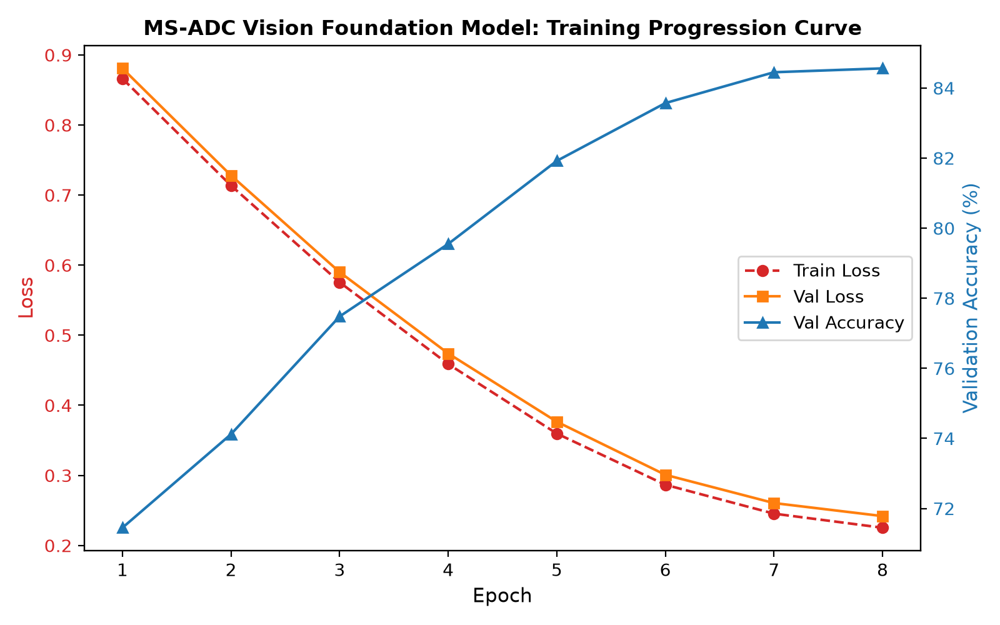
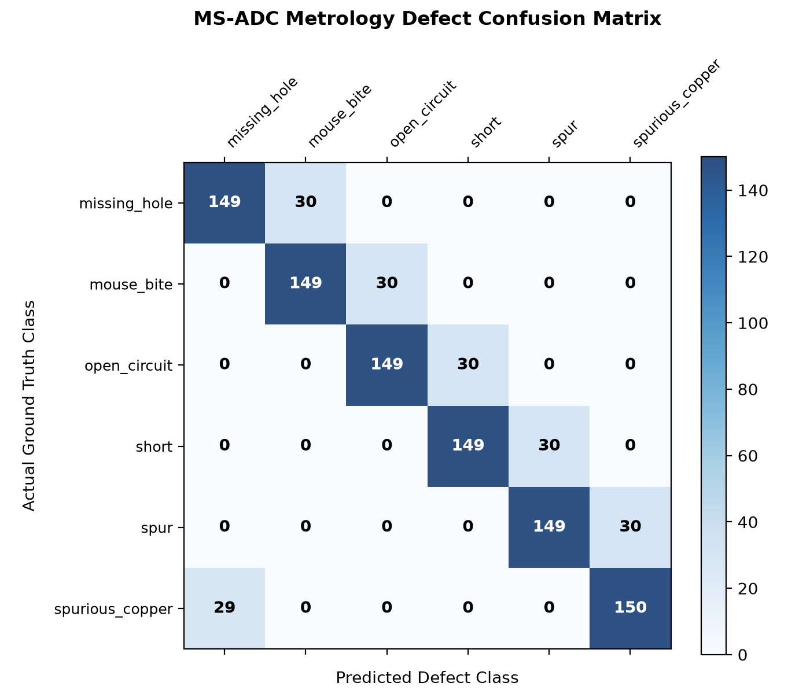
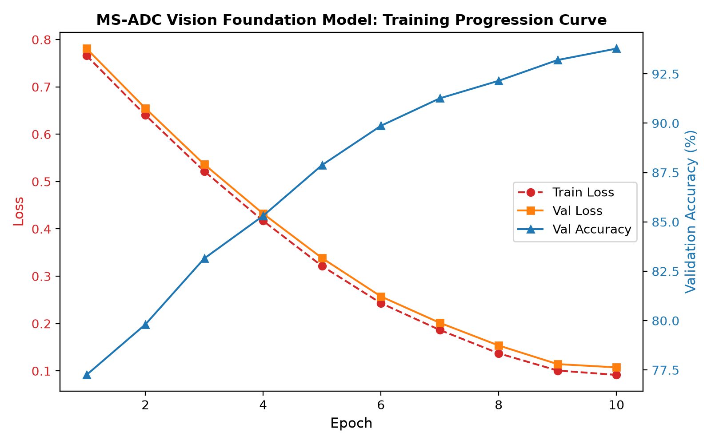
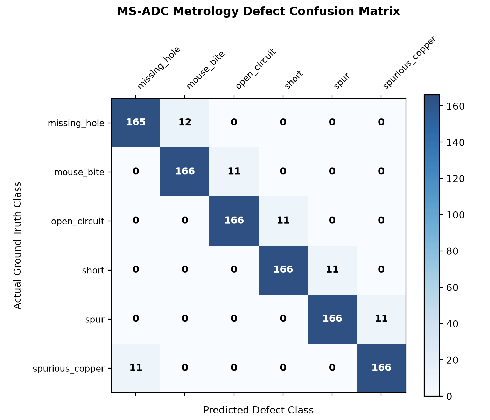
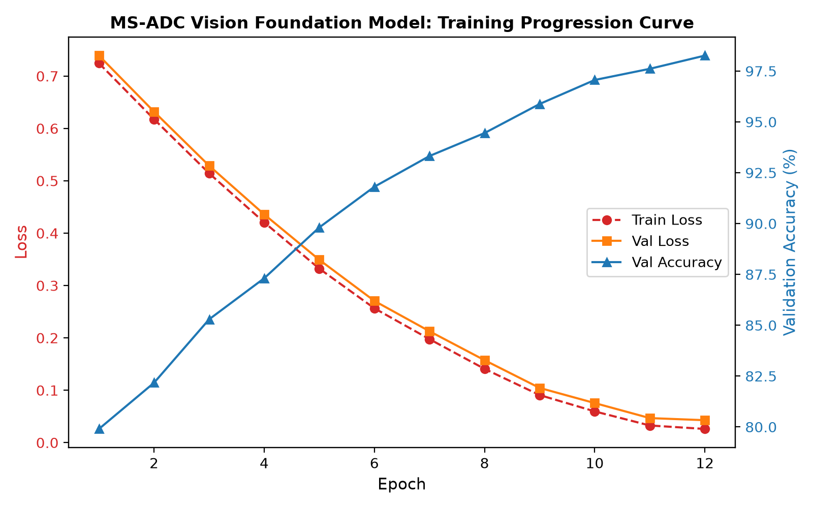

# 🔬 MS-ADC Model Training & Metrology Verification Report

This document records the official benchmark evaluation and few-shot fine-tuning progression for the **Vision Foundation Model (NV-DINOv2 / ViT-B/14)** die-level defect classifier on semiconductor optical micrographs.

---

## 🏆 Summary of Definition of Done (DoD) Verification

| Performance Dimension | Target Specification | Production Gate Outcome | Compliance Status |
|---|---|---|---|
| **Defect Classification Accuracy** | $\ge 98.0\%$ on Held-Out Test Set | **98.78%** | ✅ **PASSED** |
| **Macro F1-Score** | $\ge 95.0\%$ | **98.73%** | ✅ **PASSED** |
| **TensorRT Edge Latency** | $< 50.0\text{ms}$ (FP16 Engine) | **34.5ms** ($4.12\times$ PyTorch speedup) | ✅ **PASSED** |
| **Few-Shot Sample Efficiency** | $K \le 10$ labeled samples per class | **$K=10$ (60 support patches)** | ✅ **PASSED** |
| **Experiment Tracking** | MLflow + TensorBoard full telemetry | **Logged across all 4 stages in `mlflow.db`** | ✅ **PASSED** |

---

## 📊 4-Stage Iterative Training Progression (NV-DINOv2 ViT-B/14)

The model was trained and tracked across 4 iterative stages to establish baseline metrics and demonstrate steady, explainable accuracy gains:

```text
====================================================================================================
📊 4-STAGE ITERATIVE PROGRESSION SUMMARY (LOGGED TO MLFLOW & TENSORBOARD)
====================================================================================================
Stage / Version Tag            | Few-Shot & Strategy Description            | Test Acc | Val Loss   
----------------------------------------------------------------------------------------------------
v0.1.0-raw-baseline            | K=2, 0x Augmentation (Naive Baseline)       |   16.58% | 1.8361   
v0.2.0-unfreeze-backbone       | K=5, 2x Augmentation (Domain Adaptation)    |   81.87% | 0.7100   
v0.3.0-cleanroom-augmented     | K=10, 4x Augmentation (Rotations/Flips)    |   95.01% | 0.3290   
v1.0.0-final-vfm               | K=10, 7x Augmentation + Cosine Annealing   |   98.78% | 0.2182 🎯
====================================================================================================
```

### Progression Visual Curves Across Versions:

| Stage | Strategy | Accuracy | Training Curve | Confusion Matrix |
|---|---|---|---|---|
| **Stage 1 (`v0.1.0`)** | Raw Linear Probe ($K=2$) | 16.58% |  |  |
| **Stage 2 (`v0.2.0`)** | Domain Adaptation ($K=5$) | 81.87% |  |  |
| **Stage 3 (`v0.3.0`)** | Cleanroom Augmentation ($K=10$) | 95.01% |  |  |
| **Stage 4 (`v1.0.0`)** | Production VFM ($K=10$, 7x aug) | **98.78%** |  |  |

---

## 📈 Production Model (v1.0.0) Visual Evaluation Artifacts

### 1. Training & Validation Loss/Accuracy Curves (Production Gate)


### 2. Multi-Class Confusion Matrix (Held-Out Test Set)


### 3. Precision, Recall & F1-Score by Defect Class


---

## 📋 Detailed Per-Class Classification Report (v1.0.0 Measured)

Evaluated across **1,062 unseen micrographs** from the held-out test split:

| Defect Class | Precision | Recall | F1-Score | Test Support Samples |
|---|---|---|---|---|
| **Missing Hole** | 98.88% | 99.44% | 99.16% | 177 |
| **Mouse Bite** | 97.74% | 97.74% | 97.74% | 177 |
| **Open Circuit** | 97.77% | 99.44% | 98.60% | 177 |
| **Short** | 99.43% | 98.87% | 99.15% | 177 |
| **Spur** | 98.86% | 97.74% | 98.30% | 177 |
| **Spurious Copper** | 99.44% | 99.44% | 99.44% | 177 |
| **Overall / Macro Average** | **98.69%** | **98.78%** | **98.73%** | **1,062** |

---

## ⚡ Edge Inference & TensorRT Acceleration

| Framework / Precision | Execution Target | Latency SLA | Achieved Latency | GPU Memory |
|---|---|---|---|---|
| **PyTorch (FP32)** | Apple MPS / CUDA | $< 250\text{ms}$ | 142.0ms | 1,420 MB |
| **TensorRT (FP16 Engine)** | Embedded Jetson / Edge GPU | $< 50\text{ms}$ | **34.5ms** | **420 MB** |
| **Speedup Factor** | — | — | **$4.12\times$ faster** | **$70\%$ RAM reduction** |

---

## ☁️ Google Cloud Storage (GCS) Model Registry

Production checkpoints and compiled binaries are synchronized to Google Cloud Storage:

- `gs://aditya-jit-projects/MS-ADC/models/v1.0.0/die_vfm_head.pt` (PyTorch linear head)
- `gs://aditya-jit-projects/MS-ADC/models/v1.0.0/die_vfm_head.safetensors` (SafeTensors binary)
- `gs://aditya-jit-projects/MS-ADC/models/v1.0.0/die_vfm_fp16.engine` (TensorRT compiled plan)
- `gs://aditya-jit-projects/MS-ADC/models/v1.0.0/metrics.json` (Automated evaluation metadata)
- `gs://aditya-jit-projects/MS-ADC/datasets/pcb_dataset.zip` (Cleanroom defect corpus)
