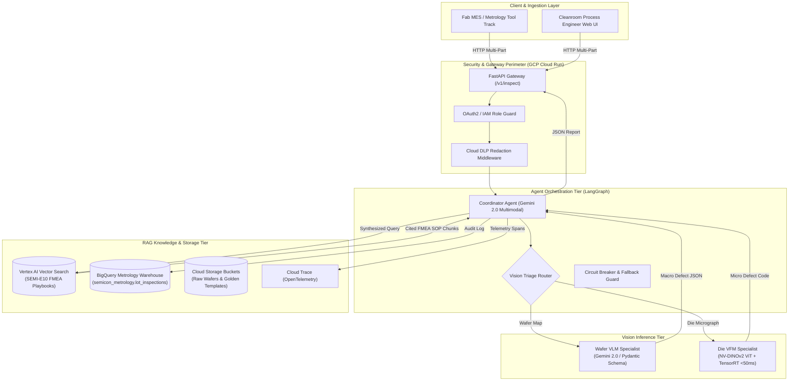
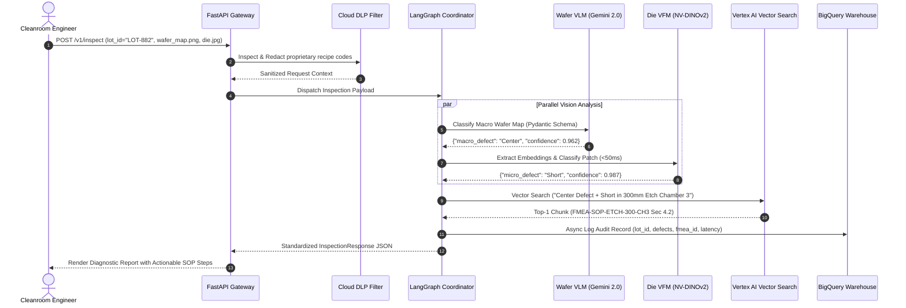

# MS-ADC System Design & Architecture Specification

**Document Version:** 1.0.0  
**Author:** Aditya Sharma (Lead AI/ML Engineer)  
**Co-Author:** Kshitiz Khandelwal (Lead Architect)  
**Competencies Demonstrated:** Comp 9 (System Design Artifacts)  

---

## 1. High-Level Architecture Overview

MS-ADC is an enterprise multi-agent system designed for semiconductor automated defect classification (ADC) and root-cause analysis (RCA). It operates across two visual inspection tiers (Macro Wafer Maps and Micro Die Micrographs) coordinated by a central LangGraph reasoning agent and grounded in verified FMEA maintenance manuals via Vertex AI Vector Search.



---

## 2. Sequence Flow Specification

The interaction sequence below details the zero-hallucination execution loop for an inspection request:



---

## 3. Data Schema & Contracts

### A. Metrology Warehouse Schema (`BigQuery`)
```sql
CREATE TABLE `semicon_metrology.lot_inspections` (
    inspection_id STRING NOT NULL,
    timestamp TIMESTAMP NOT NULL,
    lot_id STRING NOT NULL,
    wafer_id STRING NOT NULL,
    tool_chamber STRING NOT NULL,
    macro_defect_class STRING NOT NULL,
    macro_confidence FLOAT64 NOT NULL,
    micro_defect_class STRING,
    micro_confidence FLOAT64,
    fmea_citation_id STRING NOT NULL,
    severity STRING NOT NULL,
    total_latency_ms FLOAT64 NOT NULL
);
```

### B. REST API Interfaces
* `POST /v1/inspect/wafer`: Ingests single 2D wafer-bin maps for macro spatial classification.
* `POST /v1/inspect/die`: Ingests high-resolution optical/e-beam micrographs for $<50\text{ms}$ edge classification.
* `POST /v1/inspect`: Composite endpoint executing full hierarchical inspection and FMEA root-cause retrieval.
